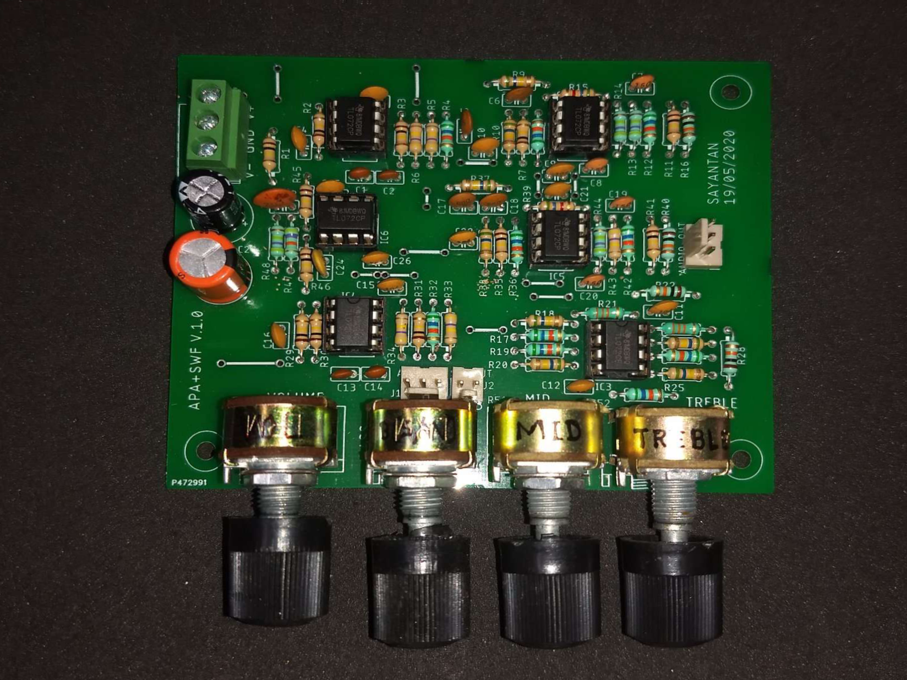
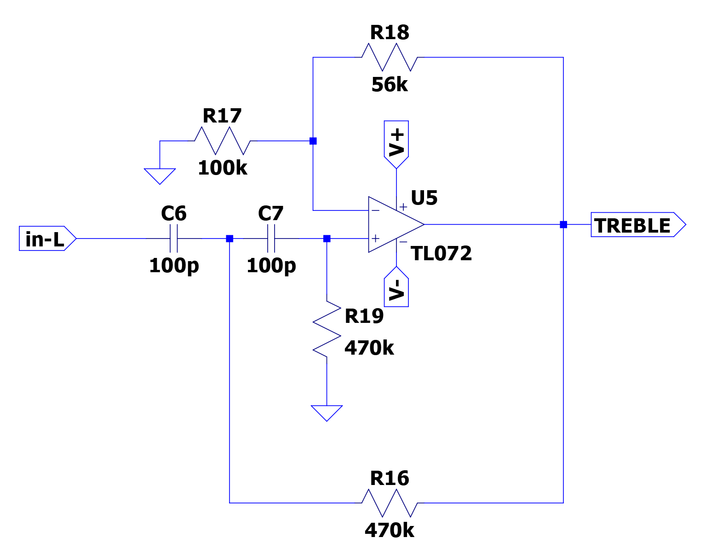
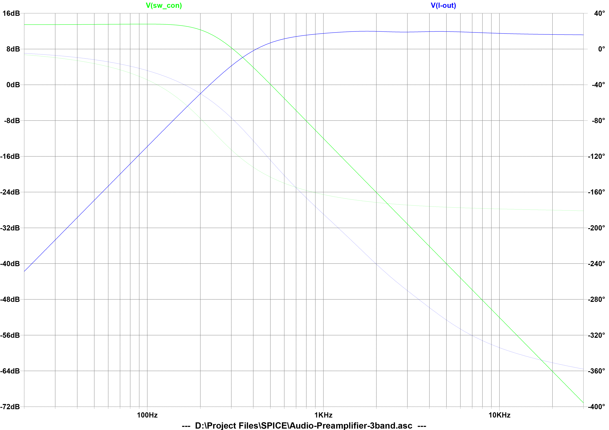
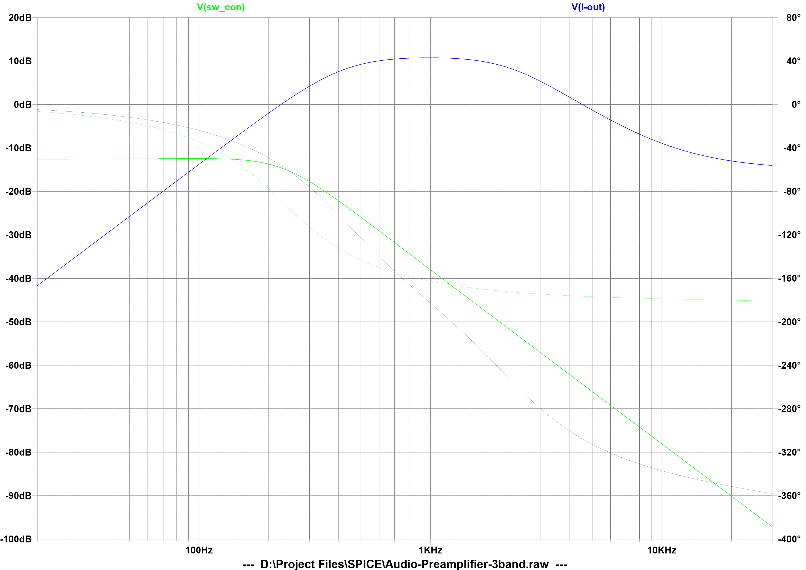
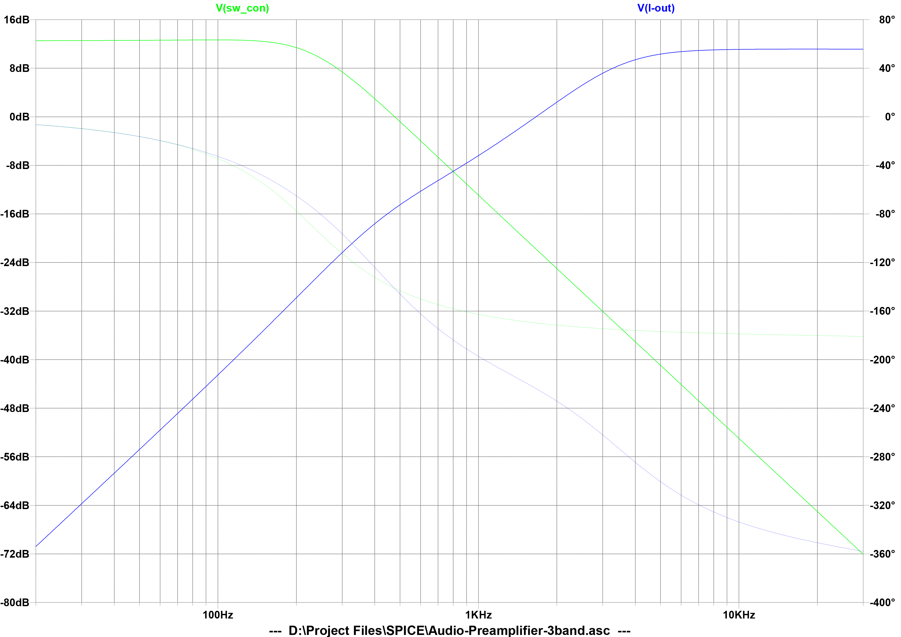
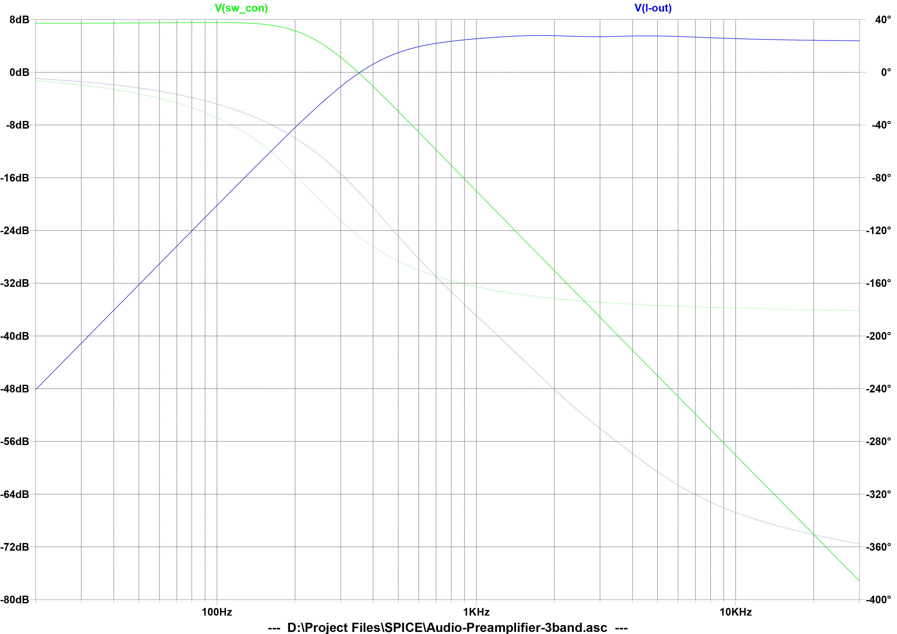
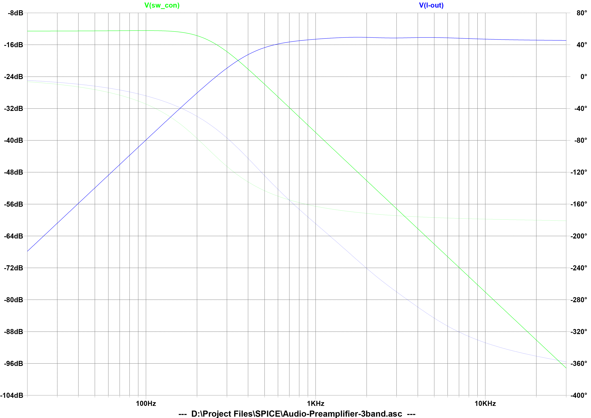

# Audio-Preamplifier-With-3-band-Equalizer 
This repo contains the PCB layout and circuit diagram for audio preamplifier with *3 band equalizer* and *crossover* filter for subwoofer.   

 **Figure:** The preamplifier circuit board

 **Figure:** PCB top

 **Figure:** PCB bottom

## Table of damping ratio for designing Butterworth filter of different orders.
|Order||Stages|||
|-----|------|------|-----|-----|
|1|Stage-A:  1st Order||||
|2|Stage-A:  2nd Order; k = 0.707||||
|3|Stage-A:  1st Order|Stage-B:  2nd Order; k = 0.5|||
|4|Stage-A:  2nd Order; k = 0.3825|Stage-B:  2nd Order; k = 0.924|||
|5|Stage-A:  1st Order|Stage-B:  2nd Order; k = 0.309|Stage-C:  2nd Order; k = 0.809||
|6|Stage-A:  2nd Order; k = 0.259|Stage-B:  2nd Order; k = 0.707|Stage-C:  2nd Order; k = 0.966||
|7|Stage-A:  1st Order|Stage-B:  2nd Order; k = 0.2225|Stage-C:  2nd Order; k = 0.6235|Stage-D:  2nd Order; k = 0.901|
|8|Stage-A:  2nd Order; k = 0.190|Stage-B:  2nd Order; k = 0.5555|Stage-C:  2nd Order; k = 0.8315|Stage-D:  2nd Order; k = 0.981|
---

>**NOTE:** k is the damping ratio of the filter which decides the response of the filter. Quality factor, Q = 1 / 2k.

## Designing the low-pas filter for BASS band (also acts as a crossover filter for subwoofer)

 **Figure:** Low pass filter for BASS-band

**Filter type:** 2nd order Butterworth low-pass, multiple feedback filter  
**Target:** |gain| = 4 (12 dB), cutoff freq., f_c = 250 Hz, k = 0.707  
**Designed:**

## Designing the band-pass filter for MID band

 **Figure:** Band pass filter for MID-band

**Filter type:** 2nd order mid-pass, cascade two Sallen-Key filters (stage-A & stage-B)  
### Stage-A (2nd order Butterworth high-pass filter)
**Target:** gain = 3 - 2k = 3 - 2 * 0.707 = 1.586, f_c = 420 Hz, k = 0.707  
**Designed:**

### Stage-B (2nd order Butterworth low-pass filter)
**Target:** gain = 3 - 2k = 3 - 2 * 0.707 = 1.586, f_c = 2.30 kHz, k = 0.707  
**Designed:**

## Designing the low-pass filter for TREBLE band

 **Figure:** Low pass filter for TREBLE-band

**Filter type:** 2nd order Butterworth low-pass, Sallen-Key filter  
**Target:** gain = 3 - 2k = 3 - 2 * 0.707 = 1.586, f_c = 3.30 kHz, k = 0.707  
**Designed:**

>**NOTE:** Before running simulation in LT Spice "potentiometer.asc" & "potentiometer.asy" must be copied to appropriate symbol folder (e.g. C:\Users\<User Name>\Documents\LTspiceXVII\lib\sym) and copy the TL072.LIB to the "sub" folder (e.g. C:\Users\<User Name>\Documents\LTspiceXVII\lib\sub)

 **Figure:** OUTPUT CURVE-BASS=100%, MID=100%, TREBLE=100%

 **Figure:** OUTPUT CURVE-BASS=5%, MID=100%, TREBLE=5%

 **Figure:** >OUTPUT CURVE-BASS=90%, MID=5%, TREBLE=100%

 **Figure:** OUTPUT CURVE-BASS=50%, MID=50%, TREBLE=50%

 **Figure:** OUTPUT CURVE-BASS=5%, MID=5%, TREBLE=5%

## References
- [Wath the video on YouTube](https://youtu.be/h-8pL9eNuU0)
- [Schematic](./Schematic/Schematic-Basic.pdf)
- [OKAWA Electric Design](http://sim.okawa-denshi.jp/en/Fkeisan.htm)
- [Integrated Electronics by Millman & Halkias](https://books.google.co.in/books/about/Integrated_Electronics.html?id=Qta8v9hJBMAC)
