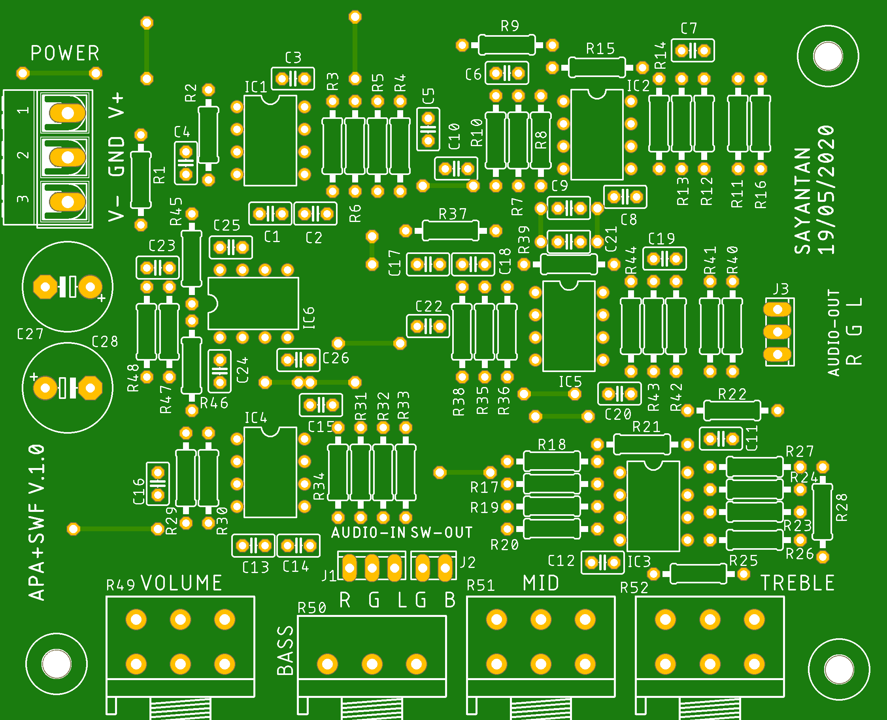

# Audio-Preamplifier-With-3-band-Equalizer
This repo contains the PCB layout and circuit diagram for audio preamplifier with 3 band equalizer and crossover filter for subwoofer

## Table of damping ratio for designing Butterworth filter of different orders.
|Order||Stages|||
|-----|------|------|-----|-----|
|1|Stage-A:  1st Order||||
|2|Stage-A: 2nd Order; k = 0.707||||
|3|Stage-A: 1st Order|Stage-B: 2nd Order; k = 0.5|||
|4|Stage-A: 2nd Order; k = 0.3825|Stage-B: 2nd Order; k = 0.924|||
|5|Stage-A: 1st Order|Stage-B: 2nd Order; k = 0.309|Stage-C: 2nd Order; k = 0.809||
|6|Stage-A: 2nd Order; k = 0.259|Stage-B: 2nd Order; k = 0.707|Stage-C: 2nd Order; k = 0.966||
|7|Stage-A: 1st Order|Stage-B: 2nd Order; k = 0.2225|Stage-C: 2nd Order; k = 0.6235|Stage-D: 2nd Order; k = 0.901|
|8|Stage-A: 2nd Order; k = 0.190|Stage-B: 2nd Order; k = 0.5555|Stage-C: 2nd Order; k = 0.8315|Stage-D: 2nd Order; k = 0.981|
>**NOTE:** k is the damping ratio of the filter which decides the response of the filter. Quality factor, Q = 1 / 2k.

## Designing the low-pas filter for BASS band (also acts as a crossover filter for subwoofer)

Filter type: 2nd order Butterworth low-pass, multiple feedback filter
Target: |gain| = 4 (12 dB), cutoff freq., f_c = 250 Hz, k = 0.707  
Designed:

## Designing the band-pass filter for MID band

Filter type: 2nd order mid-pass, cascade two Sallen-Key filters (stage-A & stage-B)
### Stage-A (2nd order Butterworth high-pass filter)
Target: gain = 3 - 2k = 3 - 2 * 0.707 = 1.586, f_c = 420 Hz, k = 0.707  
Designed:

### Stage-B (2nd order Butterworth low-pass filter)
Target: gain = 3 - 2k = 3 - 2 * 0.707 = 1.586, f_c = 2.30 kHz, k = 0.707  
Designed:

## Designing the low-pass filter for TREBLE band

Filter type: 2nd order Butterworth low-pass, Sallen-Key filter
Target: gain = 3 - 2k = 3 - 2 * 0.707 = 1.586, f_c = 3.30 kHz, k = 0.707  
Designed:

## References
- [Schematic](./Schematic.pdf)
- [OKAWA Electric Design](http://sim.okawa-denshi.jp/en/Fkeisan.htm)
- [Integrated Electronics by Millman & Halkias](https://books.google.co.in/books/about/Integrated_Electronics.html?id=Qta8v9hJBMAC)
